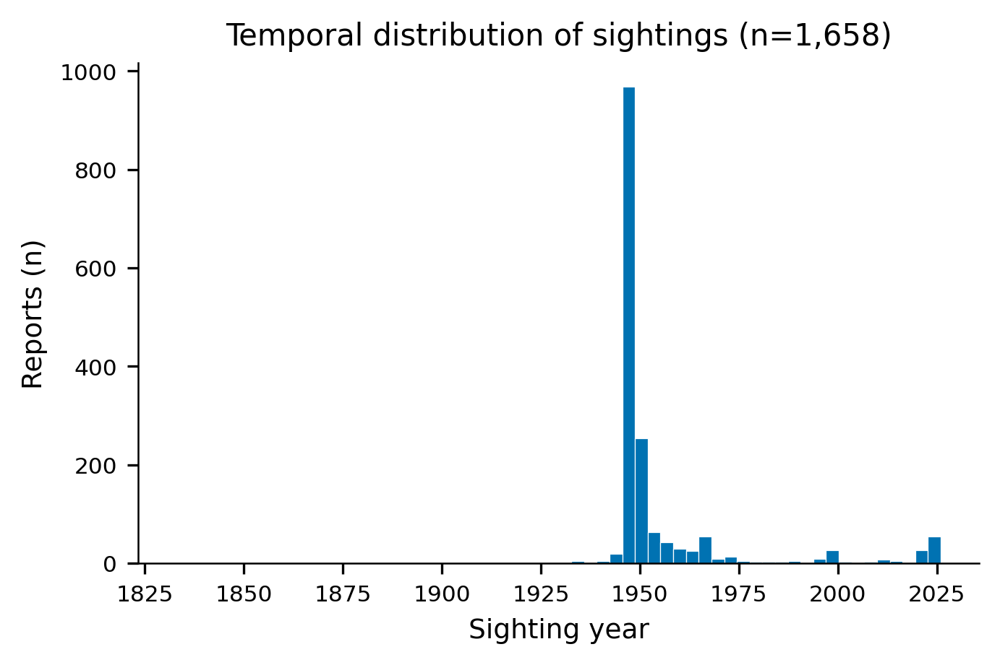
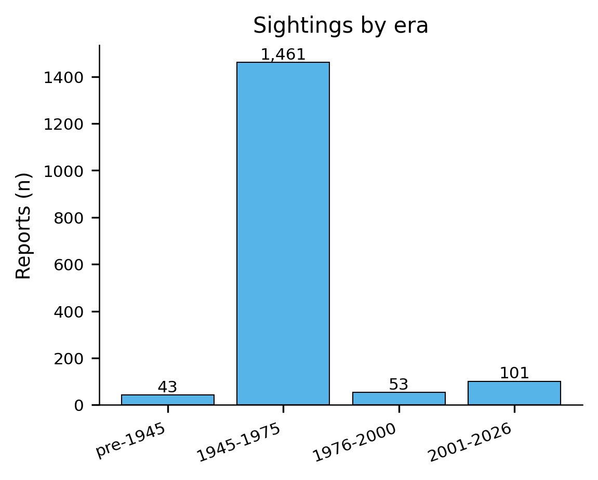
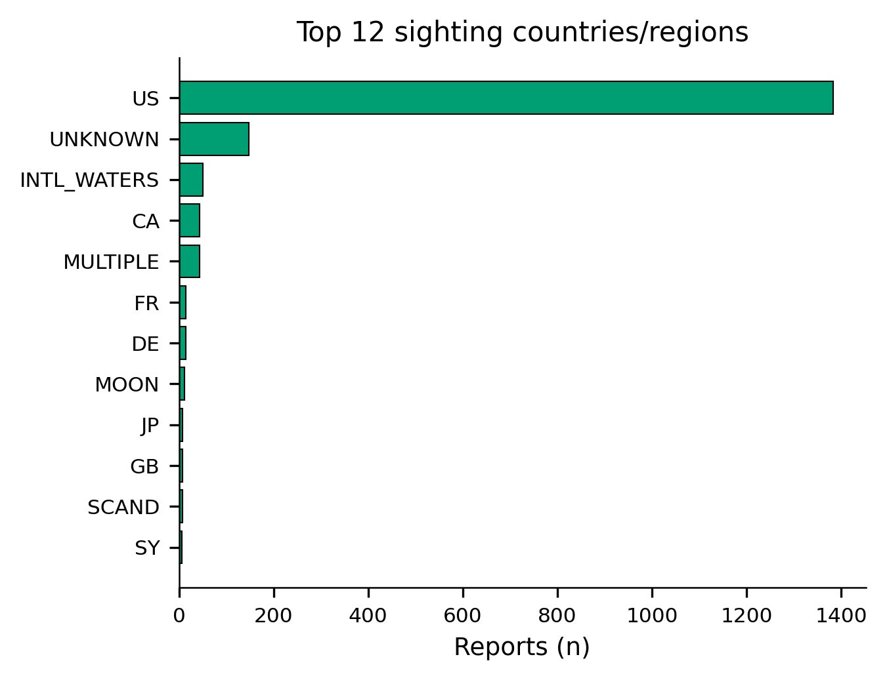
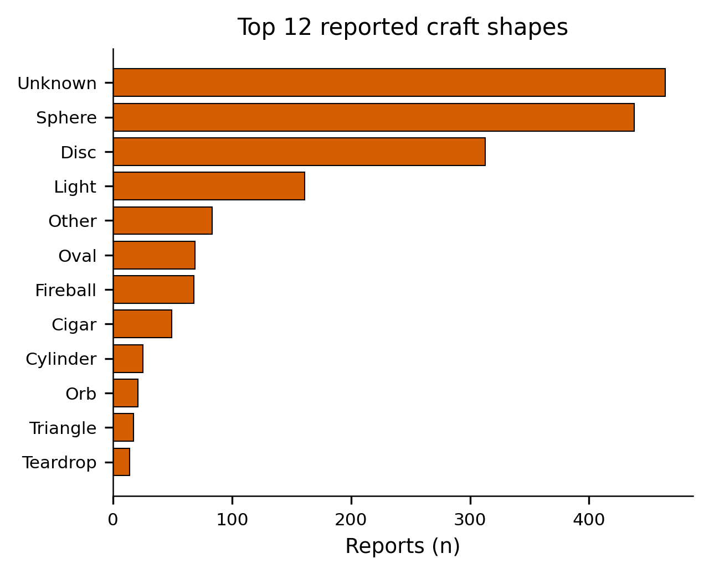
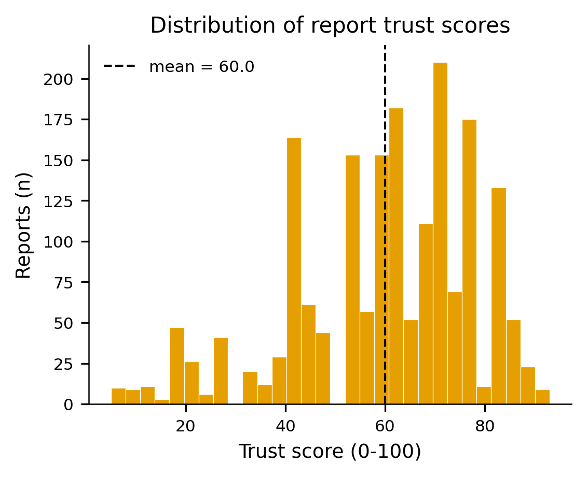
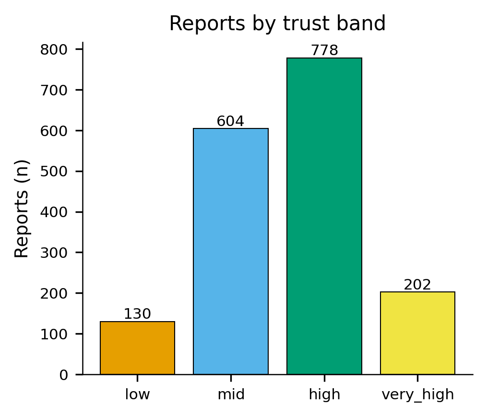
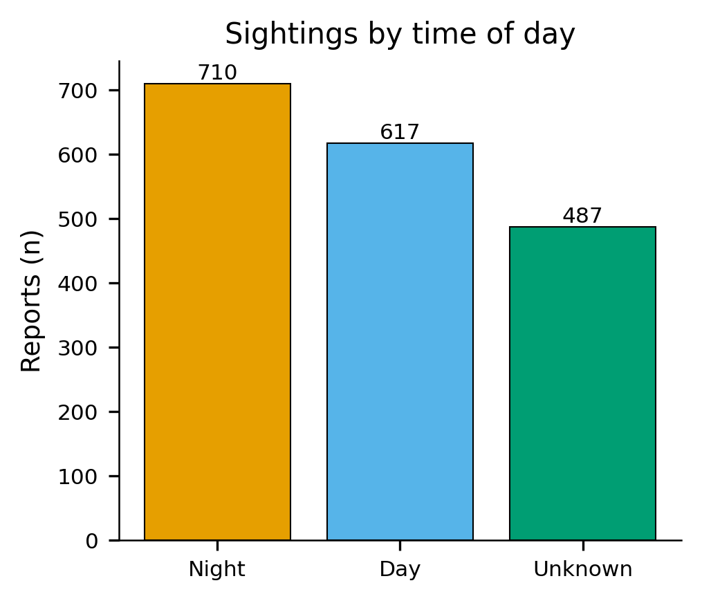
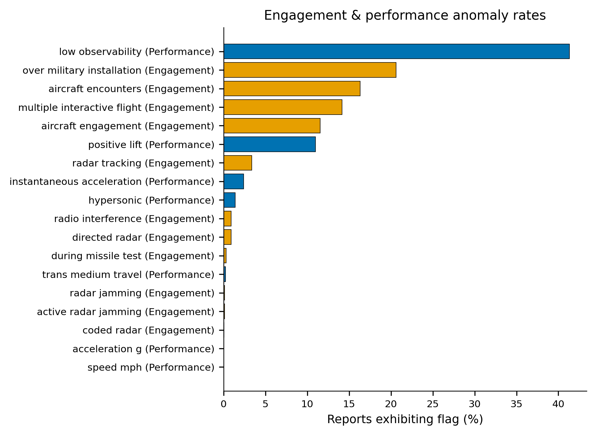
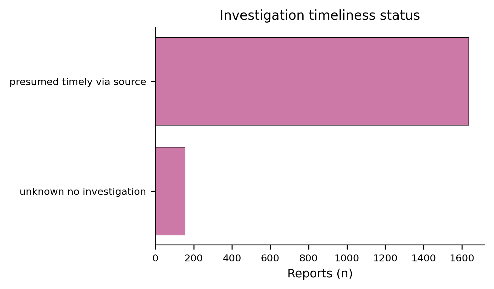
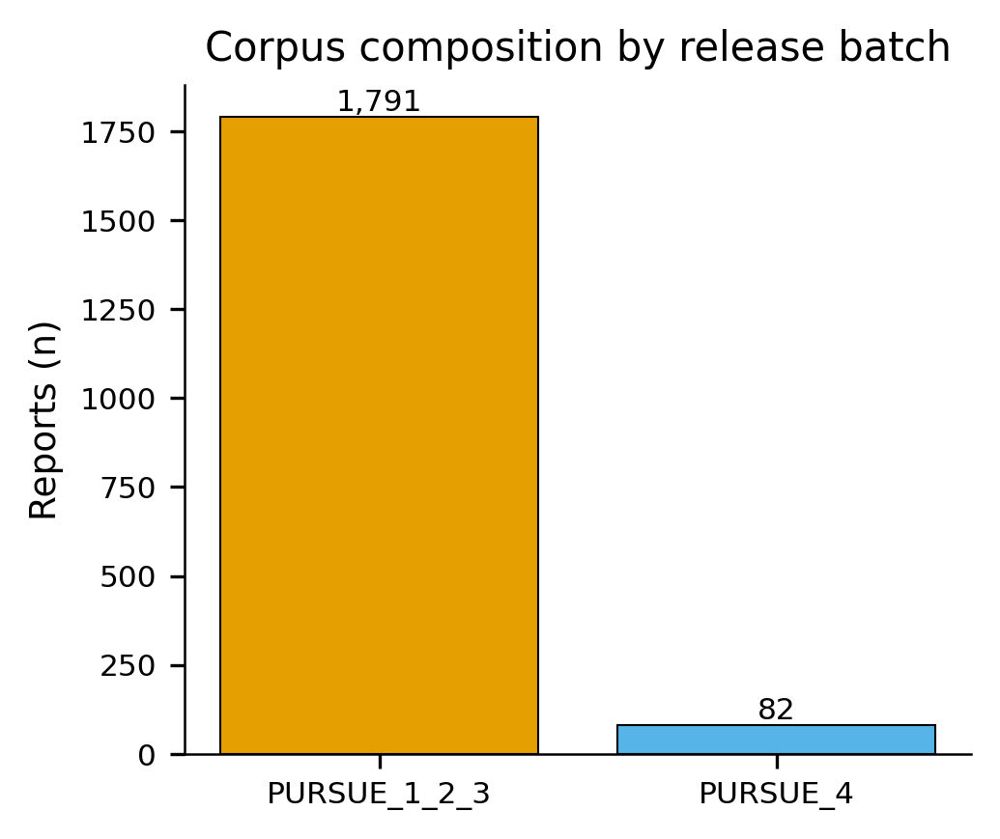

# What the Government's UFO Files Actually Say

Nearly two thousand declassified sighting reports, pulled straight from the
Department of War's own UAP release archive. No speculation, no theories —
just what's actually in the paperwork the government chose to make public.
Here's what the numbers show.

## A Wave of Sightings That Still Defines the Story

If you plot every sighting in this archive by year, one thing jumps out
immediately: a single, enormous spike.

**1947.** Almost a thousand individual reports cluster around that one year —
dwarfing everything before or after it. This is the "flying disc" summer, the
moment the phrase "flying saucer" entered the American vocabulary after pilot
Kenneth Arnold's sighting near Mount Rainier in June 1947. What this chart
shows is just how seriously the reporting apparatus took it at the time:
whatever people were seeing that summer, the government was writing it down
by the hundreds.

Zoom out to the broader eras and the pattern holds:

Three out of every four reports in this archive fall in the 1945–1975 window —
the early Cold War decades when radar, jet aircraft, and nuclear anxiety were
all colliding for the first time. The modern era (2001–2026) is a much smaller
slice, not because sightings stopped, but because this particular archive is
weighted toward the older, newly-declassified material.

## Where in the World

Unsurprisingly, the overwhelming majority of reports — 1,383 of them — are
tied to the United States. But look past the top bar: "INTERNATIONAL WATERS"
shows up as its own distinct category with 51 reports. These are sightings
logged by ships and aircraft crews out at sea, far from any coastline —
exactly the kind of witness (trained military observers, standardized
instrumentation, no light pollution) that skeptics usually wish they had more
of.

## What Are People Actually Seeing?

Strip away the "Unknown" category (464 reports — the honest majority, since
most witnesses genuinely can't pin down a precise shape in the moment) and two
shapes dominate everything else: **Sphere** (438) and **Disc** (313). Between
them, spheres and discs account for more reports than every other named shape
combined — triangles, cylinders, and the rest trail well behind. If you've
ever wondered whether "flying saucer" was just a 1947 media invention or an
actual recurring pattern in what people report, this chart is the closest
thing to an answer: the disc shape shows up again and again, decades apart,
across completely unrelated witnesses.

## How Much Do We Trust These Reports?

Every report in this archive carries a trust score — a 0–100 rating based on
witness credibility, corroboration, and internal consistency.

The average sits at 60 out of 100, and the distribution is broad rather than
clustered at the bottom — this isn't a pile of obviously dismissible reports.
Break it into bands and the picture gets sharper:

Nearly a thousand reports — high plus very-high combined — sit in the upper
trust tiers. That's not a fringe minority; that's close to half the entire
archive rated as credible-to-highly-credible by whatever standard produced
this score.

## Night Sky, Day Sky

Slightly more sightings happen at night (710) than during the day (617), which
tracks with intuition — unusual lights are easier to notice against a dark
sky. But the daytime number is far from negligible, and it argues against the
easy dismissal that this is all just misidentified stars, planets, or
aircraft lights. A disc-shaped object reported at 617 daylight sightings isn't
explained by "it was probably Venus."

## Encounters With the Military

This is where the archive gets genuinely striking. A cluster of fields track
whether a sighting involved some form of direct interaction with military
assets or defied conventional physics:

- **41.3%** of reports flag "low observability" — meaning the object was
  difficult to track on radar or visually, despite being seen.
- **20.6%** occurred directly **over a military installation.**
- **16.3%** involved a direct **aircraft encounter.**
- **14.2%** described **multiple interactive flight** maneuvers — the object
  appeared to be responding to, or interacting with, the observer.
- **11.5%** logged an **aircraft engagement** specifically.
- **11%** exhibited **positive lift** with no visible means of propulsion.

Read that first line again: two out of every five reports in this archive
involve something that shouldn't have been hard to track, but was. And a full
fifth of all reports happened directly over sensitive military ground. This
isn't background noise — it's a recurring signature across a dataset spanning
eighty years.

## Where the Investigations Stand Today

Most of the archive — 1,637 reports — is marked "presumed timely via source,"
meaning the original documentation was processed close to when the sighting
occurred. A smaller set, 154 reports, are flagged as having had no formal
investigation at the time. Put together, this is a body of evidence that was,
for the most part, actually looked at when it came in — not simply filed away
and forgotten.

## Who Released This

This report draws on 1,873 sighting records spanning four separate document
releases from the Department of War, published between May and July 2026 —
the most substantial voluntary release of UAP-related material in the
program's history. The bulk of the archive (1,791 reports) comes from the
first three releases; the newest batch adds another 82 documents, several of
which — after cross-checking — turned out to describe events already on
record in the earlier releases, corroborating each other independently.

---

*Source: PURSUE government-release corpus, compiled from official Department
of War UAP document releases 1–4 (war.gov/UFO). Figures generated from the
merged sighting-report dataset; full technical documentation available in the
project repository.*
